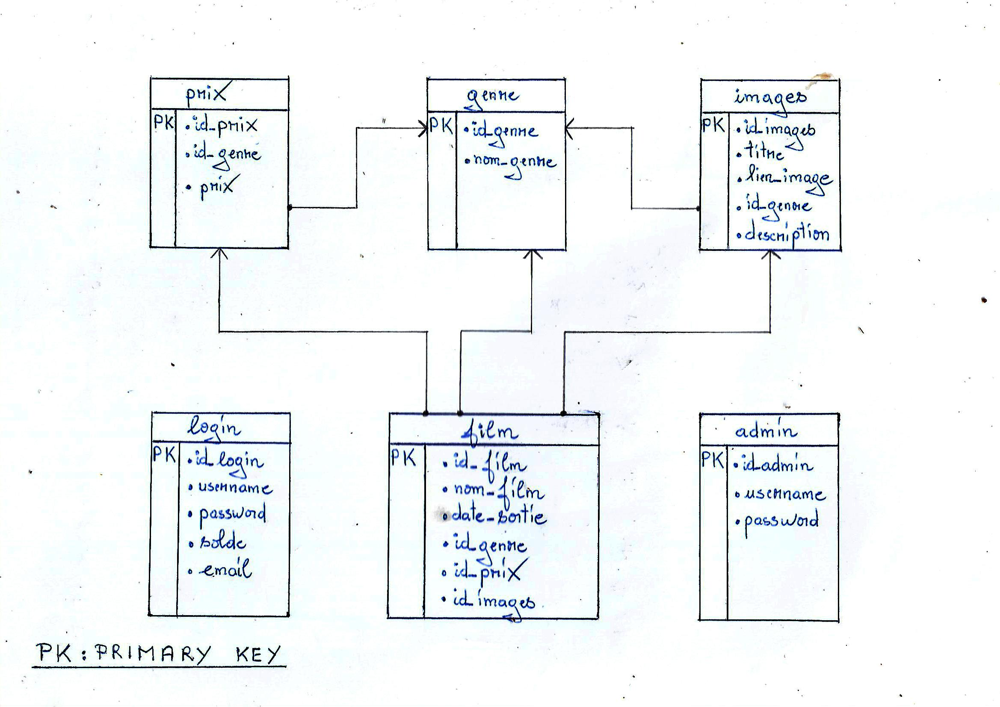

# BibliothèqueFilms

Créé par :  
Nom : RAFIDiARIMANANA  
Prénom : Hasina Nandrianina


## Bibliothèque de films:  
Création d'une page utilisateur permettant aux utilisateurs d'acheter et de découvrir les dernières nouveautés du film, tandis que l'administrateur est chargé de la gestion des données

## mise à jour du site (nouveau) : http://bbfilm.rf.gd/

## Mot de passe de l'administration:
Nom d'utilisateur : admin<Br>
Mot de passe : admin

# PRÉSENTATION DU PROJET
# I. Base de données

### Diagramme de la base de données



### Création de la base de données : "libraryfilms"
```MySQL
CRÉER BASE DE DONNÉES bibliothèquefilms;
```

### Pour utiliser la base de données créer
```MYSQL
USE  libraryfilms;
```

### Création de la table "admin"
```MYSQL
CREATE TABLE  admin 
(
  id_admin int NOT NULL AUTO_INCREMENT,
  username varchar(255) NOT NULL,
  password varchar(255) NOT NULL,
  PRIMARY KEY (id_admin)
) ;
```

### Création de la table "login"
```MYSQL
CREATE TABLE login
(
  id_login int NOT NULL AUTO_INCREMENT,
  username varchar(255) NOT NULL,
  password varchar(255) NOT NULL,
  solde bigint NOT  NULL,
  email varchar(200) NOT NULL,
  PRIMARY KEY (id_login)
);
```

### Création de la table "genre"
```MYSQL
CREATE TABLE  genre
(
  id_genre int NOT NULL AUTO_INCREMENT,
  nom_genre varchar(255) NOT NULL,
  PRIMARY KEY (id_genre)
);
```

### Création de la table "prix"
```MYSQL
CREATE TABLE prix
(
  id_prix int NOT NULL AUTO_INCREMENT,
  id_genre int NOT NULL,
  prix bigint NOT NULL,
  FOREIGN KEY (id_genre) REFERENCES genre(id_genre),
  PRIMARY KEY (id_prix)
);
```

### Création de la table "images"
```MYSQL
CREATE TABLE images
(
  id_images int NOT NULL AUTO_INCREMENT,
  titre varchar(255) NOT NULL,
  lien_image varchar(255) ,
  id_genre int NOT NULL,
  description text,
  FOREIGN KEY (id_genre) REFERENCES genre(id_genre),
  PRIMARY KEY (id_images)
);
```

### Création de la table "film"
```MYSQL
CREATE TABLE film
(
  id_film int NOT NULL AUTO_INCREMENT,
  nom_film varchar(255) NOT NULL,
  date_sortie date,
  id_genre int NOT NULL,
  id_prix int NOT NULL,
  id_images int NOT NULL,
  FOREIGN KEY (id_genre) REFERENCES genre(id_genre),
  FOREIGN KEY (id_prix) REFERENCES prix(id_prix),
  FOREIGN KEY (id_images) REFERENCES images(id_images),
  PRIMARY KEY (id_film)
);
```


# II. Toutes les requêtes utilisées dans le projet

## 1. INSERTION

### Insérer les données de l'utilisateur dans la base de données
```MYSQL
INSERT INTO login (username, password, solde, email)
VALUES ('$username','$passMasquer',5000, '$mail');
```

### Requête pour insérer les données dans la table images
```MYSQL
INSERT INTO images (titre, lien_image, id_genre, description)
VALUES ('$nom', '$lien', '$IDgenre', '$contenu');
```

### Insertion des données dans la table film
```MYSQL
INSERT INTO film (nom_film, date_sortie, id_genre, id_prix, id_images)
VALUES ('$nom', '$dateDesortie', '$IDgenre', '$IDprix', '$idImage');
```

### Insertion des données dans la table genre
```MYSQL
INSERT INTO genre (nom_genre) VALUES ('$genre');
```

### Requête pour insérer le prix du genre dans la table prix
```MYSQL
INSERT INTO prix (id_genre, prix) VALUES ('$idG', '$prix');
```


## 2. RECHERCHE (Affichage)

### Requête pour obtenir les informations de l'utilisateur connecté
```MYSQL
SELECT username, password, solde FROM login 
WHERE username='".$_SESSION["username"]."';
```

### Requête pour obtenir les genres de films
```MYSQL
SELECT id_genre, nom_genre FROM genre ORDER BY nom_genre;
```

### Requête pour récupérer les informations des films avec pagination
```MYSQL
SELECT film.id_images, film.nom_film, prix.prix
FROM film
JOIN genre ON film.id_genre = genre.id_genre
JOIN prix ON film.id_prix = prix.id_prix 
ORDER by date_sortie DESC 
LIMIT $premier_element, $elements_par_page;
```

### Requête pour obtenir le nombre total d'éléments (films)
```MYSQL
SELECT COUNT(*) AS total FROM film;
```

### Requête pour obtenir les informations du film à partir de son ID d'image
```MYSQL
SELECT film.nom_film, genre.nom_genre, prix.prix, images.lien_image, images.description
FROM film
JOIN genre ON film.id_genre = genre.id_genre
JOIN prix ON film.id_prix = prix.id_prix
JOIN images ON film.id_images = images.id_images
WHERE images.id_images = '$idfilm';
```

### Requête pour récupérer les films par leur genre avec pagination (ex: Action)
```MYSQL
SELECT film.id_images, film.nom_film, prix.prix
FROM film
JOIN prix ON film.id_prix = prix.id_prix
JOIN genre ON film.id_genre = genre.id_genre
WHERE genre.nom_genre = 'Action'
LIMIT $premier_element, $elements_par_page ;
```

### Requête pour rechercher les films par nom avec pagination
```MYSQL
SELECT film.id_images, film.nom_film, prix.prix
FROM film
JOIN prix ON film.id_prix = prix.id_prix
JOIN genre ON film.id_genre = genre.id_genre
WHERE film.nom_film LIKE '%$recherche%'
LIMIT $premier_element, $elements_par_page ;
```

### Requête pour récupérer l'ID du prix associé au genre du film dans la table "prix"
```MYSQL
SELECT id_prix FROM prix WHERE id_genre='$IDgenre';
```

### Requête pour récupérer les données des genres et leurs prix associés depuis les tables "genre" et "prix"
```MYSQL
SELECT genre.id_genre, genre.nom_genre, prix.prix
FROM genre JOIN prix
ON genre.id_genre = prix.id_genre 
ORDER by nom_genre;
```


## 3. SUPPRESSION 

### Requête pour supprimer le genre et ses prix associés de la base de données
```MYSQL
DELETE genre, prix
FROM genre
INNER JOIN prix ON genre.id_genre = prix.id_genre
WHERE genre.id_genre ='$id';
```

### Requête pour supprimer le film et ses images associés de la base de données
```MYSQL
DELETE images, film
FROM images
INNER JOIN film ON images.titre = film.nom_film
WHERE film.nom_film = '$nom';
```


## 4. MIS A JOUR

### Mettre à jour le solde dans la base de données
```MYSQL
UPDATE login SET solde='$newSolde' WHERE username='".$_SESSION["username"]."' ;
```

### Requête pour mettre à jour le nom du genre et son prix dans les tables genre et prix
```MYSQL
UPDATE genre
JOIN prix ON genre.id_genre = prix.id_genre
SET genre.nom_genre = '$genre', prix.prix = '$prix'
WHERE genre.id_genre='$ID'
AND prix.id_genre='$ID' ;
```


# III. PROJET
## FONCTIONNEMENT DES DIFFERENTES PAGES DU PROJET

### 1. INTERFACE


- **Page initiale**
	- index.html : point d'entrée au site web http://bbfilm.rf.gd/index.html

- **Page de connexion**
	- login.php : Donne accès à des fonctionnalités exclusives pour les utilisateurs enregistrés
	- loginAdmin.php : Donne accès à des fonctionnalités exclusives d'administrateur.
	- logout.php : Permet de mettre fin à la session en toute sécurité.

- **Page d'inscription**
	- inscription.php : Permet de créer un compte personnalisé.

### 2. PAGE DE L'UTILISATEUR


- **Page d'information de la base de donnée**
	- bddConnect.php

- **Page d'acceuil**
	- acceuil.php: Permet de regarder ou chercher les nouveaux films disponibles à l'achat.

- **Page d'achat**
	1. pageAchat.php : Permet d'acheter le film qu'on choisit.
	2.  traitementSolde.php : Permet de traiter le solde restant de l'utilisateur.
	3.  confirmationAchat.php : Confirmer l'achat et de l'envoyer par e-mail si le solde correspond

### 3. PAGE DE l'ADMINISTRATEUR


- **Page d'acceuil de l'administration**
	- acceuilAdmin.php

- **Liste de tous les film**
	- listFilm.php 

- **Ajouter/supprimer un film**
	1.  ajoutFilm.php :  Formulaire d'enregistrement des informations du film
	2.  enregistrement.php : Insérer les données du formulaire de film dans la base de données
	3.  suppressionFilm.php : Supprimer les informations du film de la base de données

- **Prix du film**
	- prixFilm.php

- **Modification/suppression prix du film**
	1.  modificationGenreEtPrix.php : Formulaire de mise à jour du genre du film
	2.  RetourModification.php : Formulaire de mise à jour du genre du film
	3.  UpdateGenreEtPrix.php : Mettre à jour le genre et le prix du film dans la base de données
	4.  suppression.php : Supprimer les genres et les prix des films de la base de données

- **Reglage des prix** 
	1.  reglagePrix.php : Ajouter un nouveau genre de film avec prix dans la base de données.
	2.  RetourReglagePrix.php : Message d'erreur lors de l'insertion du genre s'il existe déjà.

- **Page d'erreur**
	- erreurSuppression.php

- **Page de confirmation**
	- RetourOk.php

- **Page pour gerer le solde de l'utilisateur**
	1.  solde.php : Formulaire de recherche de nom d'utilisateur.
	2.  RetourSolde.php : Affichage des utilisateurs correspondants.
	3. modificationSolde.php : Mise à jour du solde de l'utilisateur.
